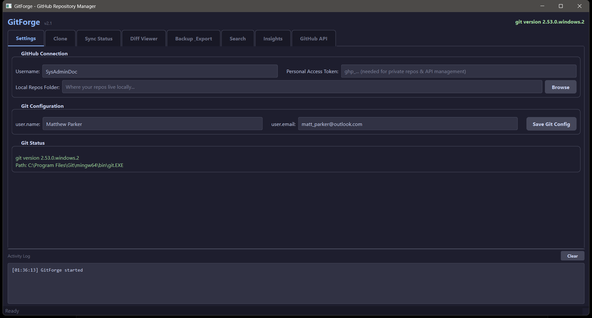

# GitForge


> A complete GitHub repository manager with a dark-themed GUI — clone, sync, diff, backup, search, and manage all your repos from one tool.


<!-- Take a screenshot of the app and save it as screenshot.png in the repo root -->

## Quick Start

```bash
git clone https://github.com/SysAdminDoc/GitForge.git
cd GitForge
python gitforge.py  # Auto-installs dependencies on first run
```

That's it. GitForge auto-installs `PyQt6` and `requests` on first launch. No virtual environments, no config files, no manual setup.

## Features

| Tab | Feature | Description |
|-----|---------|-------------|
| **Settings** | Git Auto-Detection | Finds git from PATH, GitHub Desktop, Program Files, and Scoop installs |
| **Settings** | Git Config Editor | Set global `user.name` and `user.email` without touching the terminal |
| **Settings** | Persistent Config | Username, token, repos folder, and preferences saved between sessions |
| **Clone** | Bulk Clone | Fetch and clone all repos from any GitHub account in one click |
| **Clone** | Smart Update | Automatically pulls instead of re-cloning if a repo already exists locally |
| **Clone** | Selective Clone | Select/deselect individual repos, filter forks, toggle SSH vs HTTPS |
| **Clone** | Private Repos | Supports Personal Access Tokens for private repository access |
| **Sync Status** | Status Dashboard | Scans every local repo and shows branch, ahead/behind, dirty files, last commit |
| **Sync Status** | Bulk Pull | Pull all selected repos at once with `--ff-only` |
| **Sync Status** | Bulk Fetch | Fetch all remotes across all repos simultaneously |
| **Sync Status** | Bulk GC | Run aggressive garbage collection across selected repos |
| **Diff Viewer** | Working Tree Diffs | Color-coded diff output like GitHub Desktop — green additions, red deletions |
| **Diff Viewer** | Four Scan Modes | Uncommitted, staged, incoming (remote), and unpushed changes |
| **Diff Viewer** | File Actions | Stage, unstage, and discard individual files per repo |
| **Diff Viewer** | Inline Commit | Commit and push directly from the diff view with a message field |
| **Backup** | Mirror Clone | Full `--mirror` backup with all branches, tags, and refs |
| **Backup** | ZIP Export | Archive repos as `.zip` files with optional `.git` folder exclusion |
| **Backup** | Orphan Detection | Find local repos that were deleted from GitHub |
| **Backup** | Bulk GC + Reporting | Garbage collect all repos and report total disk space freed |
| **Search** | Cross-Repo Grep | Full-text `git grep` across all local repos with regex and file filters |
| **Search** | Find Dirty Repos | Quickly locate repos with uncommitted changes |
| **Search** | Find Unpushed Work | Identify repos with local commits not yet pushed |
| **Search** | Large File Finder | Scan for files over 10 MB across all repos |
| **Insights** | Stats Dashboard | Total repos, languages, disk usage, stars, forks, and private count |
| **Insights** | Language Breakdown | Table of languages sorted by repo count and total size |
| **Insights** | Largest Repos | Top 20 repos by size |
| **Insights** | Recent Activity | Repos sorted by last push date |
| **GitHub API** | Bulk Visibility | Change repos between public and private in bulk |
| **GitHub API** | Edit Descriptions | Modify repo descriptions and topics inline |
| **GitHub API** | Archive / Unarchive | Archive or restore repos in bulk |
| **GitHub API** | Create Repos | Create new repositories directly from the GUI |
| **GitHub API** | Delete Repos | Delete repos from GitHub with double confirmation safety |

## How It Works

```
┌──────────────┐     ┌──────────────────┐     ┌─────────────────────────────────┐
│  GitHub API   │────>│  GitForge Core    │────>│  Tabbed Interface (PyQt6)       │
│              │     │                  │     │                                 │
│  REST v3     │     │  AppState        │     │  Settings | Clone | Sync Status │
│  Auth Token  │     │  GitHubAPI()     │     │  Diff Viewer | Backup | Search  │
│  Rate Limits │     │  Git Detection   │     │  Insights | GitHub API          │
└──────────────┘     │  Config Persist  │     └─────────────────────────────────┘
                     └────────┬─────────┘
                              │
                     ┌────────▼─────────┐
                     │  Local Git Repos  │
                     │                  │
                     │  git clone/pull  │
                     │  git diff/grep   │
                     │  git gc/status   │
                     └──────────────────┘
```

All long-running operations (cloning, scanning, searching, API calls) run in background `QThread` workers so the GUI never locks up. Every operation supports cancellation.

## Prerequisites

- **Python 3.8+** (any recent Python install)
- **Git** — either of:
  - [Git for Windows](https://git-scm.com/download/win) (recommended)
  - [GitHub Desktop](https://desktop.github.com/) (GitForge auto-detects its bundled git)
  - Scoop: `scoop install git`
- **Windows 10/11** (primary target; should work on macOS/Linux with standard git)

## Configuration

### First Launch

1. Open the **Settings** tab
2. Enter your **GitHub username**
3. Set your **Local Repos Folder** (e.g. `C:\Users\You\Documents\GitHub`)
4. *(Optional)* Add a **Personal Access Token** for private repos and API management
5. *(Optional)* Configure your git `user.name` and `user.email`

### Personal Access Token

A token is optional for basic cloning of public repos, but required for:

- Cloning private repositories
- Bulk repo settings (visibility, descriptions, topics)
- Creating and deleting repos
- Archive/unarchive operations

Generate one at [github.com/settings/tokens](https://github.com/settings/tokens) (classic token) with these scopes:

| Scope | Required For |
|-------|-------------|
| `repo` | Private repos, API management |
| `delete_repo` | Deleting repos from the GitHub API tab |

### Git Auto-Detection

GitForge searches for git in this order:

1. System PATH (standard Git for Windows)
2. GitHub Desktop's bundled git (`%LOCALAPPDATA%\GitHubDesktop\app-*\resources\app\git\cmd\`)
3. `Program Files\Git\cmd\`
4. Scoop shims (`~\scoop\shims\git.exe`)

The detected path is shown in the Settings tab and activity log on startup.

## Usage

### Clone All Repos

1. Go to the **Clone** tab
2. Click **Fetch Repos from GitHub**
3. Select/deselect repos as needed
4. Click **Clone Selected**

Repos that already exist locally are updated with `git pull --ff-only` instead of re-cloned.

### Check Sync Status

1. Go to the **Sync Status** tab
2. Click **Scan Local Repos**
3. Each repo shows: current branch, ahead/behind counts, dirty file count, and last commit
4. Use **Pull Selected** to bulk-update repos that are behind

### View Diffs

1. Go to the **Diff Viewer** tab
2. Select a scan mode (working tree, staged, incoming, or unpushed)
3. Click **Scan for Changes**
4. Click a repo in the left panel, then a file in the middle panel
5. The right panel shows a color-coded diff
6. Stage/unstage/discard files, then commit and push directly

### Backup Your Account

1. Go to the **Backup & Export** tab
2. Choose **Mirror Clone** for a full git backup (all branches, tags, refs) or **ZIP Export** for source archives
3. Use **Find Orphaned Local Repos** to detect repos deleted from GitHub but still on disk

### Search Across Everything

1. Go to the **Search** tab
2. Enter a query with optional file filter (e.g. `*.py`) and regex toggle
3. Results show matches grouped by repo with file and line context
4. Use quick-action buttons to find dirty repos, unpushed work, or large files

### Manage Repos via API

1. Go to the **GitHub API** tab (requires token)
2. Click **Load Repos** to populate the table
3. Edit descriptions and topics by double-clicking cells
4. Bulk change visibility, archive/unarchive, or delete repos
5. Create new repos from the bottom panel

## Data Storage

GitForge stores its configuration in:

```
%APPDATA%\GitForge\config.json
```

This file contains your username, encrypted token, repos folder path, and UI preferences. No data is sent anywhere except the GitHub API when you explicitly trigger an action.

## FAQ / Troubleshooting

**Q: "Git not found" even though GitHub Desktop is installed**
A: GitForge auto-detects GitHub Desktop's bundled git. If detection fails, install [Git for Windows](https://git-scm.com/download/win) standalone — it adds git to PATH globally.

**Q: Clone fails with "[WinError 2] The system cannot find the file specified"**
A: This means git isn't on PATH. Check the Settings tab to see if GitForge detected git. If the git status shows red, install Git for Windows.

**Q: Rate limited by GitHub**
A: The GitHub API allows 60 requests/hour unauthenticated, or 5,000/hour with a token. Add a Personal Access Token in Settings to increase your limit.

**Q: Can I use this with GitLab or Bitbucket?**
A: Currently GitHub only. The API layer is abstracted, so other providers could be added in the future.

**Q: Does it support SSH cloning?**
A: Yes. Toggle **Use SSH URLs** in the Clone tab. Requires an SSH key configured with your GitHub account.

**Q: Mirror clone vs regular clone?**
A: Regular clone gives you a working copy of the default branch. Mirror clone (`--mirror`) captures every branch, tag, and ref — ideal for full backups. Mirror repos are bare (no working tree) and stored as `repo-name.git` directories.

## License

MIT License - see [LICENSE](LICENSE) for details.

## Contributing

Issues and pull requests are welcome. If you run into a bug, include the contents of `crash.log` (generated automatically on unhandled exceptions) in your report.
